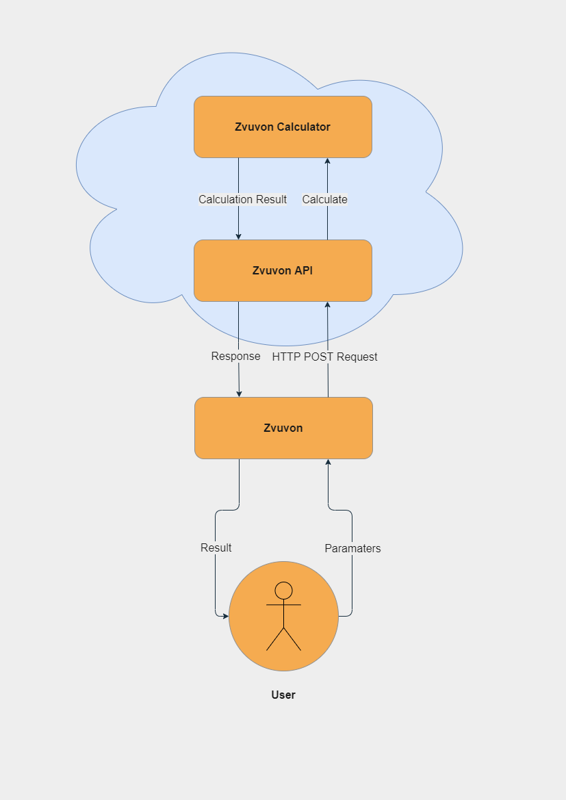

# Question 4
The way the architecture will work is by separating the backend and the frontend into their own service.
That enables us to deploy each service without having to worry about it affecting the other service.

The `Zvuvon` program (frontend) will send an `HTTP POST` request containing the parameters of the launch, 
to the `Zvuvon API` (backend), which will then parse the request, pass it to the `Zvuvon Calculator` and
return an HTTP response containing the calculation results to the `Zvuvon` program, which will display it.

Here is a diagram describing the flow of the program:

Ideally, we would also want to separate the calculator from the `REST API` each to his own service,
so in case we only want to fix or add something in the calculator, we could fix it 
and deploy it without touching or changing the `REST API`.

# Question 6
### Missing parameters
In case the API does not receive all the necessary launch parameters, it will return an error response
with status code `400_BAD_REQUEST` and an informative message (not too informative for security reasons).
### Too many parameters
In case the API receives too many parameters, it will ignore the extra parameters and take only the relevant
ones.
### Unexpected data types
In case the API receives unexpected data types, such as `string` instead of `float`, it will return an error
response with status code `400_BAD_REQUEST` and an informative message.

# Question 7
Currently, the data flows in the `HTTP` protocol which is an insecure protocol that transfers all the data
in plain text, which means that every attacker that intercepts the requests sent from the `Zvuvon` program
and the responses, can know exactly how the program works and can read sensitive data.
To solve that, we could get an SSL certificate and switch to the protocol `HTTPS` that encrypts all the data
transferred by default.

In addition to `HTTPS`, we could also manually encrypt the data sent, which means that even if an attacker
manages to decrypt the `TLS` encryption, he still won't be able to read the data.

# Question 8
In a case where two or more users are requesting the same calculation, the `Zvuvon API` could keep a small
cache limited to a certain number of entries, in which it will save key-value pairs of the calculations,
allowing for a quicker access, rather than calculating everything again.

The cache should also have an expiration date for security reasons and resource management reasons.

# Question 9
To give a quick service to all concurrent users, we could use a Load Balancer which will try to split the
requests among a group of servers, in order to ensure that no server is overworked.
So we can open multiple instances of the `Zvuvon API` on different servers, use a Load Balancer, 
and solve the problem of many concurrent users.

That will also solve other problems, such as when a server goes down, the Load Balancer will know not to
direct requests to that particular server.
